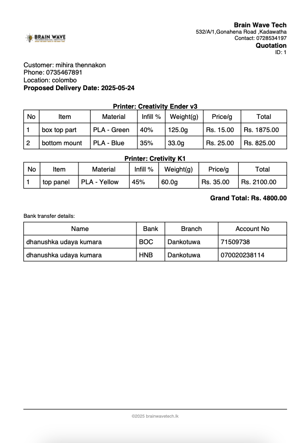

# 📦 3D Print Manager – Brain Wave Tech

A Flutter-based mobile app designed to help manage 3D printing businesses efficiently. Track filament stock, printers, customer details, generate quotations, and maintain business info – all in one place!

---

## 🖼️ App Preview

<p align="center">
  
  
  
  
</p>

---
## 📥 Download

👉 [Click here to download the latest APK](https://github.com/dhanushka47/weight_gauge_app/releases/download/v1.0.0/app-release.apk)


## ✨ Features

- 📋 **Add and manage material stock** (PLA reels with color and weight tracking)
- 🖨️ **Add multiple 3D printers**
- 👥 **Manage customers and their info**
- 🧾 **Create and generate printable quotations (PDF)**
- 📊 **Dashboard with quick summaries and stock chart**
- 🏦 **Manage payment account details**
- 🔐 **Reset or backup business data**

---

## 📱 Technologies Used

- **Flutter**
- **Dart**
- **Provider** (for state management)
- **PDF** and **printing** packages (for quotation generation)
- **Shared Preferences / Local Storage**
- **Material Design**

---

## 🔧 Installation

### 🚀 Run locally

```bash
flutter pub get
flutter run
```

> Make sure you have Flutter installed and set up on your machine.

---

## 📦 Building APK for Release

```bash
flutter build apk --release
```

For Google Play:
```bash
flutter build appbundle --release
```

---

## 🖨️ Sample Quotation Output

**Customer:** Mihira Thennakon (Colombo)  
**Total:** Rs. 4800.00

PDF contains:
- Customer & delivery details
- Printing item list with material, infill %, weight, and cost
- Bank account payment options



---

## 📇 Business Details

**Brain Wave Tech**  
532/A/1, Gonahena Road, Kadawatha  
📞 0728534197  
🌐 brainwavetech.lk

---

## 📁 Assets

Make sure to place screenshots in:  
`assets/screenshots/`

And declare them in your `pubspec.yaml` if needed.

---

## 📜 License

MIT License  
© 2025 Brain Wave Technological Institute
